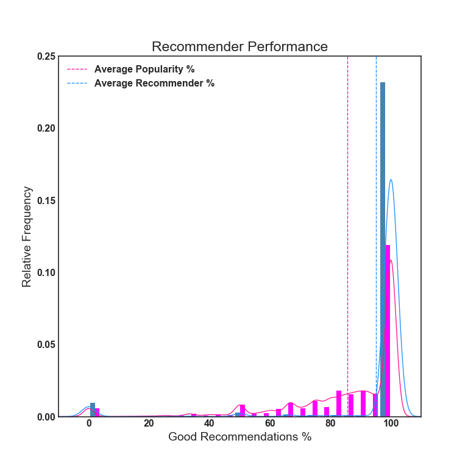

### [Apache Spark Movie Recommender](http://www.rybot.xyz)

This web app can give you some movie recommendations via collaborative filtering.

Try it out by clicking the heading above.

- download netflix-prize-data from [kaggle.com/netflix-inc/netflix-prize-data](http://www.kaggle.com/netflix-inc/netflix-prize-data) to the data directory

- install dependencies and run app/server.py
```
$ ./dependencies.sh
$ cd my_app
$ python3 server.py
```

By default, only the last three months of ratings are read in. Change the cutoff in ngn.Engine, the latest ratings are 2005/12/31

- to run with the subset of movie ratings included in this repo:
```
$ python3 server.py demo
```


## Are the recommendations any good?

The ALS model is trained with the ratings that were submitted during the earliest three-quarters of time span of the ratings. Any user who made a rating during the last quarter of time that the ratings span will be recommended by the model, they are the test users.

The model predicts which 400 movies each test user will rate the highest. These predictions are joined to the test set.

- If the recommender predicts the user will rate a movie above a 2.5, and the user gave that movie a 3 or more, then that user received a 'Good Recommendation'.

- If the recommender predicts the user will rate a movie below a 2.5, and the user gave that movie a 2 or less, then that user received a 'Good Recommendation'.

- If the recommender predicts the user will rate a movie above a 2.5, and the user gave that movie a 3 or more, then that user received a 'Bad Recommendation'.

- If the recommender predicts the user will rate a movie below a 2.5, and the user gave that movie a 2 or less, then that user received a 'Bad Recommendation'.

Each user's percent of 'Good Recommendations' are shown in the histogram.



Joining Popular movies to the test set and doing similar comparison shows that the recommender makes more good recommendations than simply recommending popular titles to every user.
